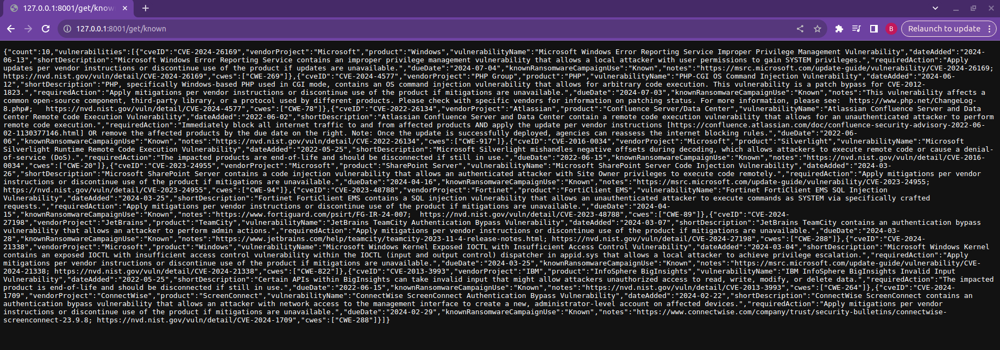

# CVE API Service

## Table of Contents
- [Installation](#installation)
- [Endpoints](#endpoints)
- [Demonstration](#demonstration)

## Installation

1. Clone the repository:
   ```
   git clone https://github.com/volodymyr-komarnyckyi/fast-api
   ```

2. Create .env file and define environmental variables following .env.sample:
   ```
   ES_URL="your_es_url"
   ES_API_KEY="your_es_api_key"
   ```
   
3. In ```/app/routers/cve_router.py``` change ```/home/volodymyr/FastAPI/exploits.json``` to your real path to a file

4. Run command:
   ```
   pip install requirements.txt
   ```

5. Run command:
   ```
   uvicorn app.main:app --reload --port 8001
   ```
   
6. App will be available at: ```127.0.0.1:8001```

## Endpoints
   ```
   "initialize db":
                   "http://127.0.0.1/init-db"
   "info" : 
                   "http://127.0.0.1:8001/info/"
   "CVEs" : 
                   "http://127.0.0.1:8001/get/all/"
                   "http://127.0.0.1:8001/get/known/"
                   "http://127.0.0.1:8001/get/new/"
                   "http://127.0.0.1:8001/get?query="
   ```

## Demonstration
```/info endpoint```


```/init-db endpoint```


```/get/all endpoint```


```/get/new endpoint```


```/get/known endpoint```



```/get?query='search_query' endpoint```


